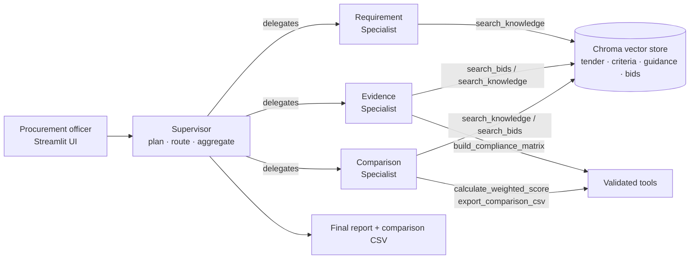
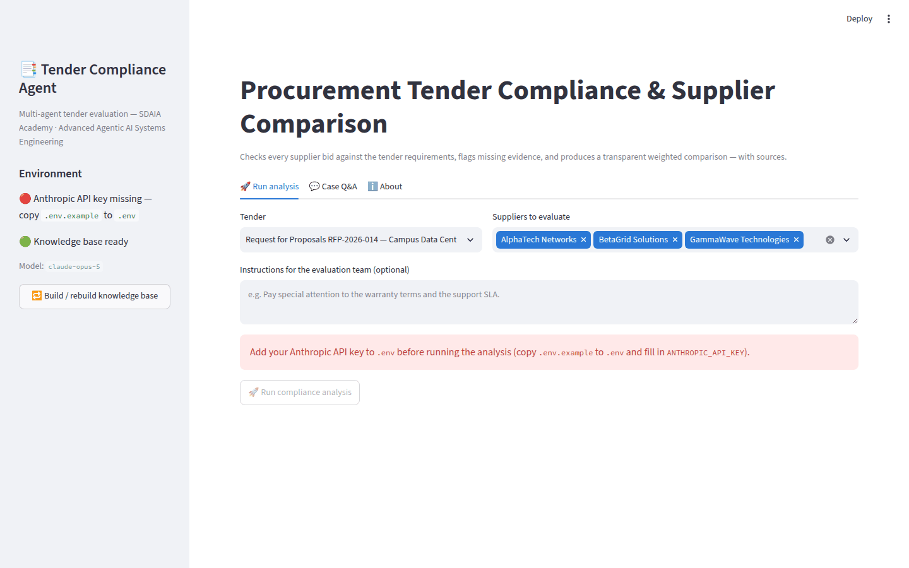
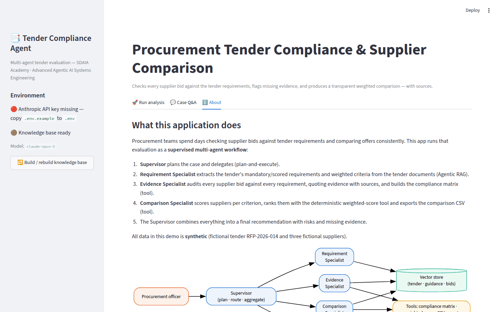

# Procurement Tender Compliance & Supplier Comparison Agent

A multi-agent AI system that checks supplier bids against tender requirements,
flags missing evidence, and produces a transparent, weighted supplier
comparison — with every judgement traced back to its source document.

> **Course:** Advanced Agentic AI Systems Engineering
> **Institution:** This project was completed as part of the *Advanced Agentic
> AI Systems Engineering* training program at **SDAIA Academy**
> ([SDAIA Academy on GitHub](https://github.com/SDAIAAcademy)).

## Team

| Name | Role |
|---|---|
| Alwaleed Alkhdairi | Team lead / development |
| _Add teammate_ | _Add role_ |
| _Add teammate_ | _Add role_ |

---

## 1. The Business Problem

**Target user:** procurement evaluation teams (public or private sector).

Evaluating a tender means reading every supplier bid against dozens of
mandatory and scored requirements, chasing missing certificates, applying a
weighted scoring methodology consistently, and documenting the evidence
behind every judgement so the award decision survives review. Done manually,
this takes days per tender, and inconsistency between evaluators is a real
audit risk — the cheapest bid may even be non-compliant and shouldn't win at
all.

**Expected value:** an evaluation assistant that performs the first full
compliance pass in minutes, never scores without citing bid evidence,
deterministically applies the weighting arithmetic, and lists exactly which
evidence is missing per supplier — so the human team starts from a complete,
sourced draft evaluation instead of a blank matrix.

## 2. The Solution

A **supervisor-led multi-agent workflow** (LangGraph + Claude) over a local
RAG knowledge base:

1. The **Supervisor** plans the case and delegates work step by step
   (plan-and-execute), then combines all findings into the final report.
2. The **Requirement Specialist** extracts the tender's mandatory
   requirements, scored requirements and weighted criteria — grounded in
   retrieved tender passages (Agentic RAG).
3. The **Evidence Specialist** audits each supplier bid requirement by
   requirement, quoting supporting evidence with file/section sources,
   consulting the procurement guidance for deviation rules, and building the
   compliance matrix with a validated tool.
4. The **Comparison Specialist** scores qualified suppliers per criterion
   from the audited evidence, ranks them with the deterministic
   weighted-score tool, and exports the official comparison CSV.

The result: a recommendation with an executive summary, key risks, a
requirement × supplier compliance matrix, a weighted ranking, the missing
evidence list per supplier, and a downloadable CSV — plus a **Case Q&A** chat
that answers follow-up questions from case memory and the documents.

### Why multi-agent (and not a form, a single prompt, or one agent)?

- The task has **three genuinely different competencies** with different
  authority boundaries: interpreting a tender (no bid access), auditing
  evidence (no scoring authority), and scoring/ranking (no authority to
  change compliance judgements). Separating them keeps each step honest and
  auditable — exactly like a real evaluation committee.
- Each specialist needs **different evidence at different times** (tender vs.
  bids vs. methodology), which agentic retrieval serves per step; a single
  prompt with everything stuffed in cannot cite or bound its judgements.
- A deterministic workflow alone can't do it either: judging whether a bid
  passage *proves* a requirement is a language-understanding task. The design
  therefore puts **judgement in agents and arithmetic in tools**.

## 3. Architecture



### Agent contracts

| Agent | Responsibility | Input | Permitted actions | Output | Completion evidence |
|---|---|---|---|---|---|
| **Supervisor** | Owns the case: plans, routes, tracks progress, stops, aggregates | User request + full state | Structured plan/route/aggregate calls only | `SupervisorPlan`, `RouteDecision`, `FinalReport` | Final report exists, or case closed as failed at the safety bound |
| **Requirement Specialist** | Extract requirements + weighted criteria | Tender ref + request | `search_knowledge` | `RequirementSet` | Every requirement listed with source; weights sum to 100 |
| **Evidence Specialist** | Audit each bid against each requirement; build matrix | `RequirementSet` + suppliers | `search_bids`, `search_knowledge`, `build_compliance_matrix` | `EvidenceReport` + matrix | Every (requirement × supplier) pair has a status backed by a quote or an explicit missing note |
| **Comparison Specialist** | Score, rank, export | Requirements + evidence + matrix | retrieval + `calculate_weighted_score`, `export_comparison_csv` | `ComparisonResult` + CSV path | Ranking comes from the scoring tool; CSV exists on disk |

### Reasoning, delegation and stopping

- **Plan-and-Execute (supervisor):** one up-front plan, then a structured
  routing decision (`RouteDecision`) after every specialist, validated
  against dependency guardrails in code (`src/agents/supervisor.py`) — an
  invalid delegation is corrected, not obeyed.
- **ReAct (specialists):** each specialist runs a bounded
  Thought → tool call → observation loop (`run_tool_loop` in `src/llm.py`),
  visible in the UI timeline.
- **Stopping conditions:** the workflow ends at `finalize` (success), on a
  specialist failure (case closed as failed with the reason), or at the hard
  supervisor step bound `MAX_SUPERVISOR_STEPS` — no silent loops. Specialist
  loops are bounded by `MAX_AGENT_TURNS`.

### State, short-term memory and long-term retrieval

- **State** (`src/graph/state.py`): one typed `TenderState` record per case —
  identity, routing control, the structured hand-offs between agents
  (`requirement_set`, `evidence_report`, `compliance_matrix`,
  `comparison_result`, `final_report`), accumulated timeline events and
  errors.
- **Short-term memory** (`src/memory/store.py`): after a run, the case is
  distilled into a `CaseMemory` (facts + findings + the Q&A conversation)
  that powers follow-up questions without re-running the analysis.
- **Long-term retrieval** (`src/rag/`): the document knowledge reused across
  cases, embedded in a persistent Chroma store.

### Agentic RAG

- **Knowledge source:** a synthetic tender (RFP-2026-014), an evaluation
  methodology, procurement guidance (informed by public good-practice
  principles such as the
  [World Bank procurement resources](https://www.worldbank.org/ext/en/what-we-do/project-procurement/for-borrowers)),
  and three synthetic supplier bids.
- **Preparation** (`scripts/ingest_knowledge.py`): load → clean → chunk on
  markdown sections (heading path preserved) → embed (Chroma's local ONNX
  MiniLM model — no embedding API key needed) → store in two scoped
  collections (`procurement_knowledge`, `supplier_bids`).
- **Runtime:** agents decide when and what to retrieve through the
  `search_knowledge` / `search_bids` tools (optionally scoped to one
  supplier). Every result carries **source metadata** (file, section, chunk
  id) which flows into evidence quotes, the UI evidence trail and the final
  report.

### Agent tools (beyond RAG retrieval)

| Tool | What it does | Validation |
|---|---|---|
| `build_compliance_matrix` | Requirement × supplier matrix, per-supplier stats, missing mandatory items, disqualification flags | Statuses enumerated; findings must reference known requirement ids |
| `calculate_weighted_score` | Weighted totals, per-criterion breakdown, ranking with tie-breaks; disqualified suppliers rank last | Weights must sum to 100; scores bounded 0–100; scorecards must cover all criteria |
| `export_comparison_csv` | Multi-section CSV (matrix, gaps, scores, recommendation) for download | Requires tender ref + matrix + scoring; safe file naming |

Tool inputs are Pydantic-validated in a central registry
(`src/tools/registry.py`); invalid inputs and runtime failures return
structured errors to the agent (`is_error` tool results) instead of crashing
the app.

## 4. Technology Stack

| Component | Choice | Why |
|---|---|---|
| Language | Python 3.11+ | Course standard |
| LLM | **Claude (`claude-opus-5`** by default, configurable) via the official `anthropic` SDK | Strong tool selection + structured outputs (`messages.parse`) |
| Orchestration | LangGraph `StateGraph` | Explicit state, conditional routing, visible delegation |
| Vector store | Chroma (persistent, local) | Simple, no external service; local ONNX embeddings |
| Validation | Pydantic v2 | Typed contracts + tool input validation |
| UI | Streamlit + Altair | Live timeline, matrix, charts, CSV download |
| Tests | pytest | Fully offline test suite (no API key needed) |

## 5. Repository Structure

```text
tender-compliance-agent/
├── app.py                      # Streamlit application
├── requirements.txt
├── .env.example                # required environment variables (no secrets)
├── data/
│   ├── knowledge/              # synthetic tender, criteria, guidance
│   └── sample_cases/           # three synthetic supplier bids
├── scripts/
│   └── ingest_knowledge.py     # build the vector store
├── src/
│   ├── config.py               # env-driven settings and bounds
│   ├── schemas.py              # typed agent contracts (Pydantic)
│   ├── llm.py                  # bounded ReAct loop + structured calls
│   ├── graph/                  # state, nodes, LangGraph workflow
│   ├── agents/                 # supervisor + three specialists + case Q&A
│   ├── memory/                 # short-term case memory
│   ├── rag/                    # loaders, chunking, vector store, retriever
│   ├── tools/                  # validated tools + registry
│   └── services/               # chart builders
├── tests/                      # offline tests incl. mocked end-to-end run
└── docs/                       # architecture, rubric map, screenshots
```

Key design decisions are documented in [`docs/architecture.md`](docs/architecture.md);
the rubric-to-evidence map is in [`docs/rubric_map.md`](docs/rubric_map.md).

## 6. Setup and Run (clean environment)

```bash
# 1. Clone and enter
git clone https://github.com/alwaleedalkhdairi/tender-compliance-agent.git
cd tender-compliance-agent

# 2. (Recommended) virtual environment
python3 -m venv .venv && source .venv/bin/activate    # Windows: .venv\Scripts\activate

# 3. Install dependencies
pip install -r requirements.txt

# 4. Configure your API key
cp .env.example .env            # then edit .env and set ANTHROPIC_API_KEY

# 5. Build the knowledge base (first run downloads a small local embedding model)
python scripts/ingest_knowledge.py

# 6. Start the application
streamlit run app.py
```

Run the tests (no API key required):

```bash
python -m pytest tests/ -q
```

### Environment variables (`.env.example`)

| Variable | Required | Purpose |
|---|---|---|
| `ANTHROPIC_API_KEY` | yes | Claude API access |
| `ANTHROPIC_MODEL` | no | Model id (default `claude-opus-5`) |
| `MAX_TOKENS` | no | Max tokens per model response (default 16000) |
| `CHROMA_DIR`, `OUTPUT_DIR` | no | Override storage locations |

Further optional tuning knobs (`MAX_SUPERVISOR_STEPS`, `MAX_AGENT_TURNS`,
`RETRIEVAL_TOP_K`, `KNOWLEDGE_DIR`, `CASES_DIR`) are read from the
environment too — see `src/config.py`.

No real key, token or personal data is committed to this repository.

## 7. Using the Application

1. Open the sidebar — it shows whether the API key and knowledge base are
   ready; build the knowledge base with one click if needed.
2. In **Run analysis**, pick the tender, select the suppliers to evaluate
   (all three by default), optionally add instructions, and click **Run
   compliance analysis**.
3. Watch the live timeline: which agent is active, its reasoning summaries,
   every tool call and the retrieved evidence with sources.
4. Read the results: recommendation + risks, requirements, the compliance
   matrix (with disqualification warnings), scores & ranking charts, and the
   per-supplier evidence trail. Download the comparison CSV.
5. In **Case Q&A**, ask follow-up questions — e.g. *"Why was BetaGrid
   disqualified?"* — answered from case memory and document retrieval.

### Example request and expected result

Evaluating **RFP-2026-014** with all three suppliers is expected to produce:

- **BetaGrid Solutions disqualified** — its ISO 27001 certification is only
  *in progress* (M1), warranty is 24 months vs. the required 36 (M4), and the
  150-day schedule exceeds the 120-day limit (M5) — despite the lowest price
  (SAR 6.2M). The guidance's material-deviation rules are cited.
- **AlphaTech Networks ranked first** among qualified bids (strong technical
  solution, 48-month warranty, premium price SAR 8.95M).
- **GammaWave Technologies qualified second** with partial gaps (40G core
  vs. 100G required as an option, subcontracted monitoring).
- A CSV export and a missing-evidence list per supplier.

(The agents' judgements — compliance statuses and per-criterion scores — can
vary slightly between runs; the weighting arithmetic, ranking rules and
disqualification logic are deterministic tools.)

### Failure handling you can demo

- No API key → clear red status + instructions (run button disabled).
- Knowledge base not built → warning + one-click build.
- No supplier selected → warning; single supplier → trivial-comparison note.
- A specialist/tool failure → the case closes cleanly as *failed* with the
  reason shown and any partial results preserved; tool input errors are
  returned to the agent, which corrects itself.

## 8. Data

All documents in `data/` are **synthetic**, written for this project: the
fictional buyer (NRUC), tender RFP-2026-014, and the three fictional
suppliers (AlphaTech Networks, BetaGrid Solutions, GammaWave Technologies).
No confidential or personal data is used. The procurement guidance is
informed by publicly available good-practice principles (e.g. World Bank
project procurement resources).

## 9. Screenshots

| Run analysis (input validation) | About / architecture |
|---|---|
|  |  |

## 10. Known Limitations & Future Improvements

**Limitations**

- Findings depend on retrieval quality: evidence expressed very implicitly in
  a bid can be judged *missing* — scores also vary slightly between runs
  (mitigated, not eliminated, by putting all arithmetic in tools).
- One tender, three bids, markdown-only ingestion; no PDF parsing yet.
- Specialists run sequentially; per-supplier audits could run in parallel.

**Future improvements**

- PDF/DOCX ingestion for real tender packages; clarification-letter
  generation for missing evidence; human-in-the-loop review checkpoints
  before finalization; evaluation harness (LLM-as-judge over golden cases);
  Arabic-language tender support.

## 11. Deployment (optional bonus)

The app runs fully locally. For a public URL, deploy to
[Streamlit Community Cloud](https://share.streamlit.io/): point it at this
repository (`app.py`), add `ANTHROPIC_API_KEY` in the app's *Secrets*
settings, and deploy. Running `scripts/ingest_knowledge.py` is not needed on
the server — use the sidebar's *Build knowledge base* button on first start.
**Public URL:** _add here if deployed_.

---

This project was developed as part of the Advanced Agentic AI Systems
Engineering training program at SDAIA Academy.

SDAIA Academy on GitHub: https://github.com/SDAIAAcademy
